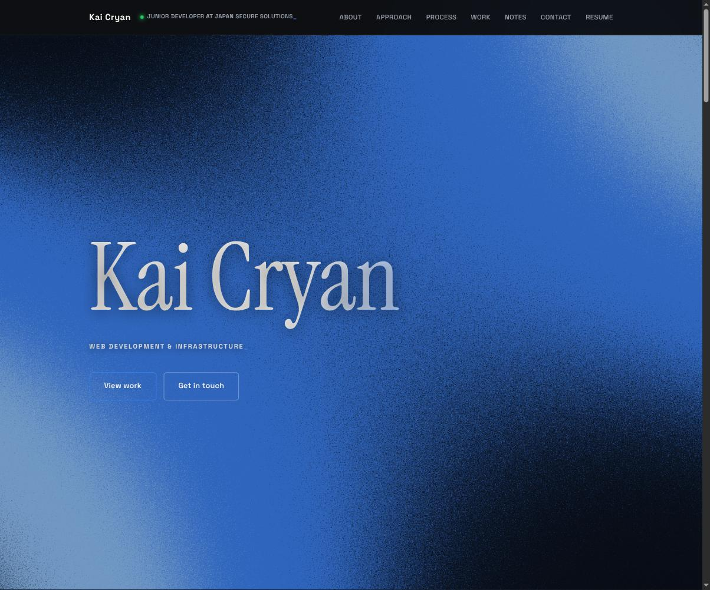

<div align="center">
  
</div>

<h1 align="center">kaicryan.dev</h1>

<p align="center">Personal portfolio for Kai Cryan — web development &amp; infrastructure.</p>

<p align="center">
  <a href="https://kaicryan.dev"></a>
  <a href="https://github.com/KaiCryan/kaicryan.dev/commits/main"></a>
  
  
</p>

---

## About

A single-page portfolio built around real project case studies rather than a
generic template — a freelance e-commerce build and a self-hosted home lab,
each written up as its own case study. The site itself, and the server
hosting it, are part of the same "build the real thing" habit described on
the page.

**Sections:** About · Approach · Process · Selected Work · Notes · Contact

## Boot sequence

<div align="center">


<sub>A themed loading sequence before the hero loads. <a href="./assets/images/screenshots/boot.mp4">Full clip (mp4)</a>.</sub>

</div>

## Selected work

| Project | What it covers |
|---|---|
| **[CODE369](https://kaicryan.dev/projects/code369.html)** | A client-commissioned brand site (fashion, music, digital tokens) — spec and hand-drawn wireframe through to a hybrid WordPress + Shopify build, self-hosted end to end. |
| **[Home Lab](https://kaicryan.dev/projects/home-lab.html)** | Replaced a stock ISP router and third-party cloud apps with a self-built ZimaOS server — AdGuard Home for DNS/DHCP, 20 Zigbee sensors driving climate automation, cloud-free photo storage. |

## Notes

Short technical write-ups, linked from the site's **Notes** section — Go
concurrency patterns, Go-from-Java quirks, what actually happens in CI vs CD,
a git workflow for small teams, TypeScript/Expo first impressions, and two
WSL gotchas that cost an afternoon each.

## Tech stack


- Vanilla HTML / CSS / JavaScript — no framework, no build step, no dependencies
- Canvas-based animated background (a drifting "signal/network" node field)
- Self-hosted on a home Docker/Linux server — the same infrastructure the
  [Home Lab](https://kaicryan.dev/projects/home-lab.html) case study describes

## Structure

```
.
├── index.html                    # About, Approach, Process, Work, Notes, Contact
├── projects/
│   ├── code369.html               # Case study: CODE369
│   └── home-lab.html              # Case study: Home Lab
└── assets/
    ├── images/                     # Screenshots, favicons, OG image
    └── files/
        └── Kai-Cryan-Resume.pdf
```

## Running locally

No build step — clone it and serve the directory:

```bash
git clone https://github.com/KaiCryan/kaicryan.dev.git
cd kaicryan.dev
python3 -m http.server 8000
# open http://localhost:8000
```

## Connect

- **Live site** — [kaicryan.dev](https://kaicryan.dev)
- **LinkedIn** — [linkedin.com/in/kaicryan](https://linkedin.com/in/kaicryan)
- **Email** — [kaithecryan@gmail.com](mailto:kaithecryan@gmail.com)

## License

All rights reserved — this is a personal portfolio; the code is here for
transparency and reference, not reuse.

<!-- systemd timer test: 2026-09-17T15:32:52+10:00 -->
